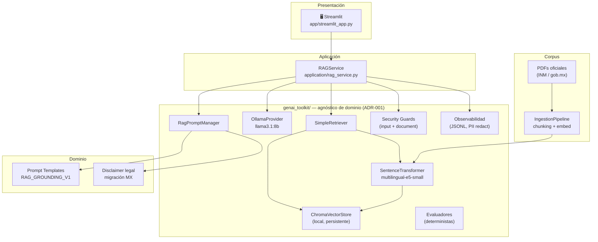

# Asesor Migratorio RAG · Mexico Immigration RAG Assistant

[](https://github.com/victorlr94/mexico-immigration-rag/actions/workflows/ci.yml)
[](https://github.com/victorlr94/mexico-immigration-rag/actions/workflows/security.yml)
[](https://github.com/victorlr94/mexico-immigration-rag)
[](LICENSE)
[](https://www.python.org/downloads/)

Asistente RAG que responde, en lenguaje natural, consultas sobre documentación
pública migratoria de México. Cada respuesta está **fundamentada en los documentos
oficiales**, cita la fuente y página, y va acompañada de un disclaimer claro.

Construido íntegramente con **tecnologías open source y modelos locales** (sin APIs
de pago). El núcleo (`src/genai_toolkit/`) es **agnóstico de dominio**: cambiar
la capa fina de dominio adapta el sistema a banca, telco, legal o compliance.

---

## Demo rápida

> **Ejemplo de consulta y respuesta con el modelo llama3.1:8b local:**
>
> **Q:** ¿Qué condiciones de estancia reconoce la Ley de Migración para los
> extranjeros?
>
> **R:** La Ley de Migración reconoce tres condiciones de estancia para los
> extranjeros: visitante, residente temporal y residente permanente. *(Fuente:
> Ley_de_Migracion.pdf, Página 37)*
>
> *AVISO: Este asistente es una herramienta informativa y no constituye asesoría
> legal. Para situaciones específicas consulta a un abogado migratorio certificado
> o al INM.*

<!-- Reemplaza con captura real de la UI: docs/assets/demo_screenshot.png -->

---

## Quickstart (5 minutos)

**Prerequisitos:** Python 3.11, [Ollama](https://ollama.com) instalado.

```bash
# 1. Clonar e instalar
git clone https://github.com/victorlr94/mexico-immigration-rag.git
cd mexico-immigration-rag
python -m venv .venv
.venv\Scripts\Activate.ps1          # Windows
# source .venv/bin/activate           # macOS / Linux
pip install -e ".[dev]"

# 2. Descargar el modelo (~4.9 GB, solo la primera vez)
ollama pull llama3.1:8b

# 3. Indexar el corpus de muestra (4 PDFs oficiales, 1 704 chunks)
python scripts/ingest.py data/samples/*.pdf

# 4. Lanzar el asistente
streamlit run app/streamlit_app.py
```

O usando el Makefile:

```bash
make demo     # instala + descarga modelo + indexa corpus
make run      # lanza Streamlit
```

---

## Arquitectura

El sistema separa el **núcleo reutilizable** del **dominio específico** (ADR-001).
Las dependencias solo fluyen hacia abajo.



### Flujo de ingesta

```
PDF → validación de seguridad → chunking (500 chars/80 overlap) → embeddings → ChromaDB
```

### Flujo de consulta

```
Pregunta → validación (longitud, vacía) → embed query → búsqueda top-6 → filtro min_score=0.70
         → contexto suficiente? → SÍ: generar con Ollama → respuesta + fuentes + disclaimer
                                → NO: refusal controlado ("No encontré información suficiente…")
```

---

## Stack tecnológico

| Capa | Herramienta | Por qué |
|---|---|---|
| Lenguaje | Python 3.11 | Tipado estricto, ecosystem AI |
| Orquestación RAG | LangChain | Abstracción de LLM + integración RAGAS |
| Vector store | ChromaDB (local) | Sin servidor, persistente, API limpia |
| Embeddings | `intfloat/multilingual-e5-small` | Multilingüe ES/EN, ~117 MB, corre en CPU |
| LLM | Ollama · `llama3.1:8b` | Local, sin APIs de pago, reproducible |
| Interfaz | Streamlit | Prototipado rápido, fácil de extender |
| Evaluación | RAGAS + evaluadores propios | Métricas estándar + deterministas sin LLM |
| Calidad | Black · Ruff · mypy strict | Formato consistente, tipos seguros |
| CI/CD | GitHub Actions | Lint + type check + tests + `pip-audit` |

---

## Corpus de muestra

4 documentos públicos oficiales del Gobierno de México incluidos en `data/samples/`:

| Documento | Páginas | Chunks | Fuente |
|---|---|---|---|
| Ley de Migración | 72 | 513 | DOF / gob.mx |
| Reglamento Ley de Nacionalidad | 15 | 110 | DOF / gob.mx |
| Lineamientos de visas (25-jul-2025) | 41 | 379 | INM |
| Lineamientos trámites y procedimientos | 84 | 702 | INM |
| **Total** | **212** | **1 704** | |

---

## Evaluación

El pipeline de evaluación tiene dos capas (ADR-006):

- **Métricas deterministas** — siempre activas, sin LLM: `refusal_quality`,
  `citation_accuracy`, `hallucination_rate`. Reproducibles bit a bit, testeables en CI.
- **RAGAS con juez local** — `faithfulness`, `answer_relevancy`, `context_precision`,
  `context_recall` usando el mismo Ollama local como juez. Best-effort (ver ADR-006).

### Resultados sobre el corpus de 13 preguntas

| Métrica | Valor | Umbral | Capa |
|---|---|---|---|
| `refusal_quality` | **0.923** ✓ | ≥ 0.90 | Determinista |
| `hallucination_rate` | **0.000** ✓ | ≤ 0.10 | Determinista |
| `citation_accuracy` | **1.000** | informativo | Determinista |
| `answer_relevancy` | **0.901** ✓ | ≥ 0.75 | RAGAS |
| `context_recall` | 0.562 | ≥ 0.70 | RAGAS (parcial)† |
| `faithfulness` | — | ≥ 0.80 | RAGAS (timeout)† |
| `context_precision` | — | ≥ 0.70 | RAGAS (timeout)† |

†*`llama3.1:8b` en CPU no sigue el ritmo paralelo de RAGAS (~57 s/evaluación).
Las métricas que requieren juicio claim-a-claim (faithfulness, context_precision)
son las más afectadas. Ver ADR-006 y `evaluations/results/baseline.json`.*

> **Lectura rápida:** las métricas deterministas —las más importantes para un
> asistente responsable— pasan todas. `answer_relevancy 0.901` confirma que las
> respuestas que sí genera el sistema son pertinentes. Los timeouts de RAGAS son
> una limitación conocida del juez local (no del sistema RAG en sí).

```bash
python scripts/evaluate.py --no-ragas      # métricas deterministas (rápido, sin LLM)
python scripts/evaluate.py                 # evaluación completa con RAGAS
python scripts/evaluate.py --update-baseline  # guarda como baseline.json
```

---

## Testing y calidad

```
276 tests · 97.96% cobertura · mypy strict (genai_toolkit/) · Black + Ruff
```

| Tipo | Tests | Qué cubre |
|---|---|---|
| Unit | ~220 | Configuración, chunking, embeddings, retrieval, evaluadores, seguridad |
| Integration | 20 | ChromaDB E2E, retrieval semántico, ingesta real con PDFs |
| Security | 39 | Adversarial (OWASP LLM01/LLM04), corpus poisoning, guards |

```bash
make test          # unit + security (sin integración, rápido)
make test-all      # suite completa (requiere Ollama)
```

Los tests de integración y E2E se excluyen de CI (requieren modelo local).
Los tests de seguridad sí corren en CI — no necesitan modelo.

---

## Seguridad

Mitigaciones implementadas siguiendo OWASP Top 10 for LLM Applications:

| Riesgo | Mitigación |
|---|---|
| LLM01 — Prompt Injection | Template con delimitadores `<context>...</context>`; contexto marcado como dato |
| LLM04 — Model DoS | Límites: 2 000 chars por query, 25 MB / 300 páginas por PDF |
| LLM06 — Data Disclosure | `redact_pii=true` en logs; hashing de queries en observabilidad |
| Corpus Poisoning | Validación de magic bytes, tamaño, página count antes de indexar |

Dependencias auditadas con `pip-audit` como gate bloqueante en CI.
Vulnerabilidades aceptadas documentadas con justificación y fecha de revisión
en [`security/accepted-vulnerabilities.txt`](security/accepted-vulnerabilities.txt) (ADR-003).

---

## Decisiones de arquitectura (ADRs)

| # | Decisión | Resumen |
|---|---|---|
| [ADR-001](docs/architecture/adr/ADR-001-domain-agnostic-toolkit.md) | Toolkit agnóstico de dominio | `genai_toolkit/` sin referencias migratorias; reutilizable en otros dominios |
| [ADR-002](docs/architecture/adr/ADR-002-pdf-loader-pypdf.md) | `pypdf ~= 6.0` para PDFs | Resuelve CVEs de DoS; PyMuPDF tiene path traversal + licencia AGPL incompatible |
| [ADR-003](docs/architecture/adr/ADR-003-pip-audit-gate.md) | `pip-audit` como gate bloqueante | Lista explícita de excepciones revisadas con fecha; nuevas vulns bloquean CI |
| [ADR-004](docs/architecture/adr/ADR-004-progressive-coverage-threshold.md) | Coverage progresivo | 30% → 50% → 70% por fase; evita falsos negativos en fases de interfaces puras |
| [ADR-006](docs/architecture/adr/ADR-006-evaluation-local-judge-degradation.md) | Evaluación en dos capas | Deterministas siempre; RAGAS best-effort con Ollama local (sin APIs de pago) |

---

## Roadmap

| Fase | Objetivo | Estado |
|---|---|---|
| 0 | Setup, arquitectura, interfaces, configuración | ✅ Completada — v0.1.0 |
| 1 | MVP RAG: ingesta, chunking, embeddings, retrieval, LLM, prompts | ✅ Completada — v0.2.0 |
| 2 | UI Streamlit + observabilidad | ✅ Completada — v0.2.0 |
| 3 | Testing (276 tests, 97.96% cov), linting, type checking | ✅ Completada — v0.3.0 |
| 4 | Evaluación RAG (RAGAS + evaluadores propios) + vitrina MVP | 🟡 En curso — v0.4.0 |
| 5 | Seguridad + red teaming completo | ⚪ Pendiente |
| 6 | CI/CD avanzado | ⚪ Pendiente (base ya existe) |
| 7 | Dockerización | ⚪ Pendiente |
| 8 | API FastAPI | ⚪ Pendiente |
| 9 | Preparación cloud | ⚪ Pendiente |

---

## Estructura del proyecto

```
src/
├── genai_toolkit/          # Núcleo reutilizable (ADR-001)
│   ├── config/             # Settings con jerarquía de precedencia
│   ├── embeddings/         # SentenceTransformerProvider
│   ├── vectorstore/        # ChromaVectorStore
│   ├── retrieval/          # SimpleRetriever + tipos compartidos
│   ├── llm/                # OllamaProvider
│   ├── prompts/            # RagPromptManager
│   ├── pipeline/           # IngestionPipeline
│   ├── security/           # Guards de entrada + documentos
│   ├── evaluation/         # Evaluadores deterministas
│   └── observability/      # Logger + JSONL store
├── domain/                 # Dominio migratorio mexicano
│   └── prompt_templates/   # RAG_GROUNDING_V1 + disclaimer
└── application/            # Orquestación
    └── rag_service.py      # RAGService: única clase que une todo

app/
└── streamlit_app.py        # Interfaz de usuario

scripts/
├── ingest.py               # CLI de ingesta
└── evaluate.py             # CLI de evaluación RAG

data/samples/               # Corpus de muestra (4 PDFs oficiales)
evaluations/                # Dataset + resultados de evaluación
docs/architecture/adr/      # Architecture Decision Records
```

---

## Disclaimer

> **Aviso legal.** Este asistente es una herramienta informativa basada en
> documentos públicos y **no constituye asesoría legal ni migratoria oficial**.
> Las respuestas se generan automáticamente y pueden ser incompletas o
> desactualizadas. Verifica siempre con las fuentes oficiales del INM y, para
> decisiones que afecten tu situación migratoria, consulta a un profesional
> acreditado.

## Licencia

[MIT](LICENSE) — los documentos en `data/samples/` son de dominio público del
Gobierno de México (Diario Oficial de la Federación / INM).
